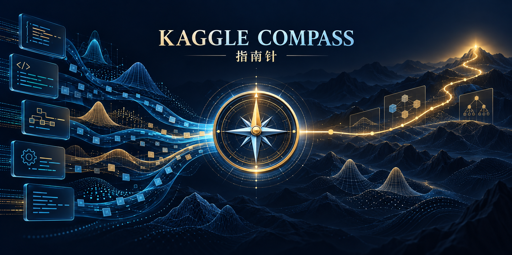

# kaggle-compass



**指南针：用误差决定方向，用证据选择组件，兼顾融合与算法开发。**

一个可安装的 Codex skill，以及可运行的轻量工具。用户说 **“指南针”** 或调用 **`$kaggle-compass`** 时，按以下循环工作：

> 批量误差画像 → 匹配社区组件 → 融合或开发 → 独立验证 → 更新画像

## 核心：两层 embedding

| 表示 | 来源 | 用途 |
| --- | --- | --- |
| 代码检索向量 | Notebook 功能模块、调用、依赖与来源 | 找相关组件，识别同源方案 |
| 实测能力向量 | 同一批分子的配对指标变化 | 判断补救、伤害和净收益 |
| 误差需求向量 | 固定误差分组的失分占比 | 决定优先攻击的方向 |

需求与能力共享分组坐标；原始代码向量不与误差向量直接算夹角。代码相似不是效果证明。单独模型高分不是融合准入条件，实际边际贡献才是。

## 初版已实现

- 不执行 Notebook 的模块提取、内容哈希及依赖来源登记。
- 确定性 256 维词法/AST 检索基线；支持导入固定 encoder 的语义向量。
- MRR@25 需求画像与组能力向量。
- 严格批次/基线/查询对齐，配对结构或骨架块 bootstrap。
- Top1 补救与伤害、MRR 得失、成本惩罚和保守实验优先级。
- 负贡献保留；块太少、未知来源及验证局限明确标注。
- 指南针技能、安装脚本、合成示例和行为测试。

**尚未实现**：自动抓取全部社区 Notebook、内置 CodeBERT 推理、自动训练融合器、候选召回/模拟器日志适配。外部语义 embedding 可导入，但需要独立生成。初版没有自动接入比赛预测或自动提交功能。

## 安装 skill

需要 Python 3.10+；运行工具仅使用标准库，无需下载模型。

```bash
git clone https://github.com/hanhan761/kaggle-compass.git
cd kaggle-compass
python scripts/install_skill.py
```

默认安装到 `$CODEX_HOME/skills/kaggle-compass`，未设置时使用 `~/.codex/skills/kaggle-compass`。安装后在新会话的技能列表中确认；明确触发方式为“指南针”或 `$kaggle-compass`。现有技能内容不同则拒绝覆盖，便于保护本地修改。

## 跑通示例

以下输入全部是**合成数据，不是比赛成绩**。

```bash
python skills/kaggle-compass/scripts/compass.py index examples/components.py --manifest examples/manifest.json --out outputs/code-index.json
python skills/kaggle-compass/scripts/compass.py search --index outputs/code-index.json --query "spectrum cosine similarity"
python skills/kaggle-compass/scripts/compass.py profile --baseline examples/baseline.json --out outputs/demand.json
python skills/kaggle-compass/scripts/compass.py compare --baseline examples/baseline.json --variant examples/variant.json --out outputs/capability.json
python -m unittest discover -s tests -v
```

示例故意包含“补了一部分错误，但也伤害强项”：匹配方向较好仍可能缺乏稳定净收益。报告不会因向量相似就批准融合。

## 使用真实项目

1. 固定冠军版本、批次、指标和评分键；准备无答案查询与独立答案分析。
2. 把社区代码按模块登记，固定来源版本、权重、候选库和 license。
3. 用代码检索缩小范围；把实际单组件或融合排名输出转换为契约格式。
4. 在开发/校准组评估能力，再以真实融合和消融确认互补性。
5. 策略冻结后验收封存组；持续记录实验、成本、失败与下一轮假设。

查看 [技能入口](skills/kaggle-compass/SKILL.md) 和 [输入契约](skills/kaggle-compass/references/contracts.md)。聚类拟合不得使用答案标签；错误分组只做离线分析，不能直接用于未知样本路由。候选库留出不代表旧预训练模型完全未见结构。

## 研究路线

先积累“代码模块 → 实测能力”配对记录；样本足够后再训练能力预测器，帮助筛选尚未运行的新算法。所有预测能力都标记为待验证，不替代实测。公开榜只作为外部证据之一。

项目工具版本 **0.1.0**，与使用它的比赛模型版本分别管理。GitHub 发布与 Kaggle 比赛提交是两种独立授权；每次比赛提交仍需用户明确允许。

README 图由内置 imagegen 生成，[完整提示词](assets/hero-prompt.md)。设计主题：指南针、误差地形、组件汇流与算法前进路径。
